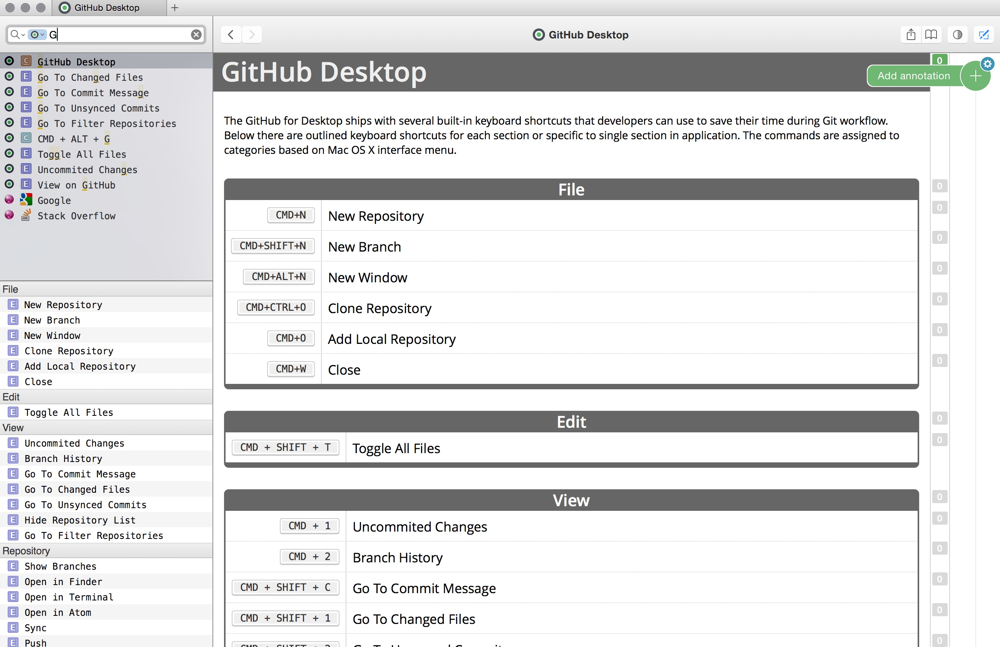
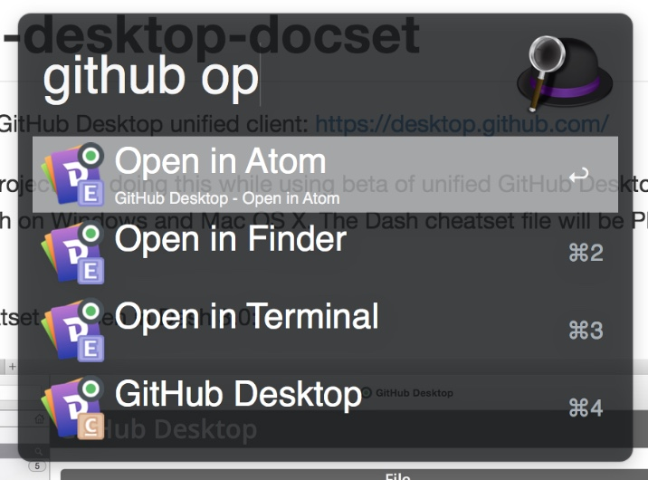
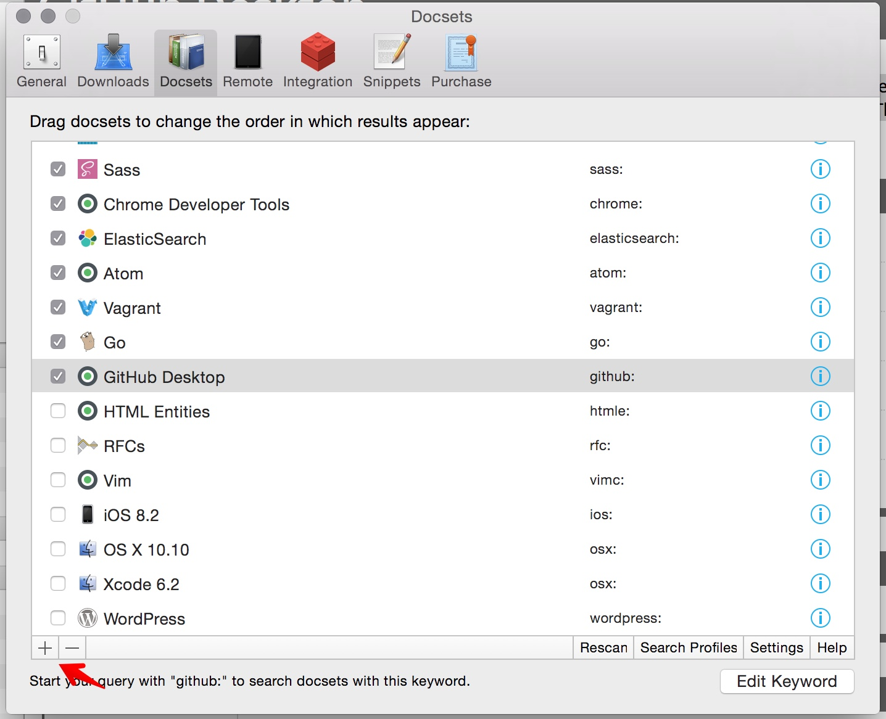

# github-desktop-docset

The GitHub for Desktop ships with several built-in keyboard shortcuts that developers can use to save their time during Git workflow. Below there are outlined keyboard shortcuts for each section or specific to single section in application. The commands are assigned to categories based on Mac OS X interface menu.

Compiled cheatset as seen after installing in Dash 3.0 (Mac OS X)



A cheatset used by Alfred 2.0 search interface:



## Installation

Either download this repository archive or clone to your local machine and then add docset manually from `Docset` section in Dash preferences:



## Development

You need to install Cheatset RubyGem first:
```
sudo gem install cheatset
```

To generate updated version of cheatset run:

```
$ cheatset generate GitHub_Desktop.rb
```

## Author
@peterblazejewicz
