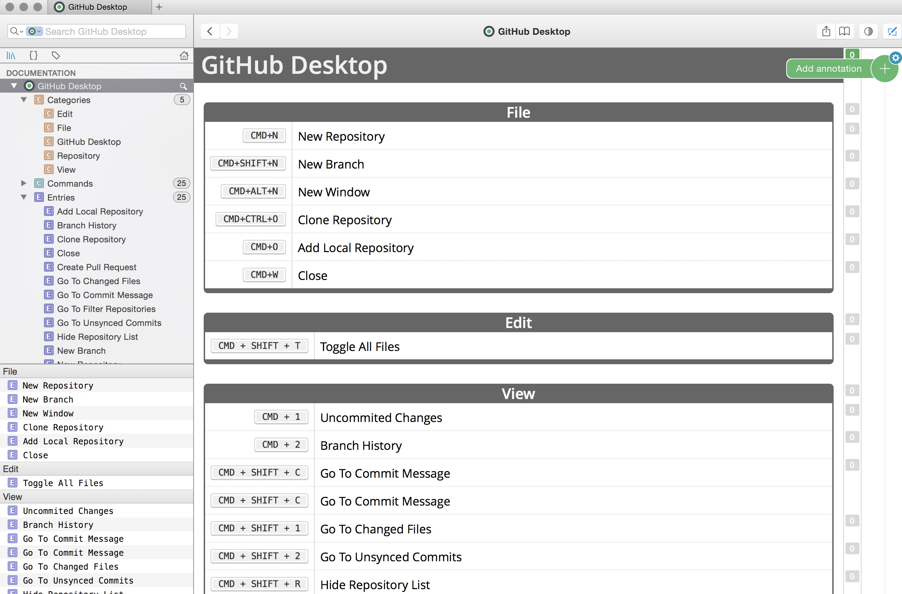

# github-desktop-docset

A cheatset for GitHub Desktop unified client: https://desktop.github.com/

This is a WIP project. I'm doing this while using beta of unified GitHub Desktop native application both on Windows and Mac OS X. The Dash cheatset file will be PR to Kapeli's Dash cheatset.

A cheatset used by Alfred in search:


Compiled cheatset as seen in Dash 3.0:



## Development

```
sudo gem install cheatset
```

```
$ cheatset generate GitHub_Desktop.rb
```

## Author
@peterblazejewicz
